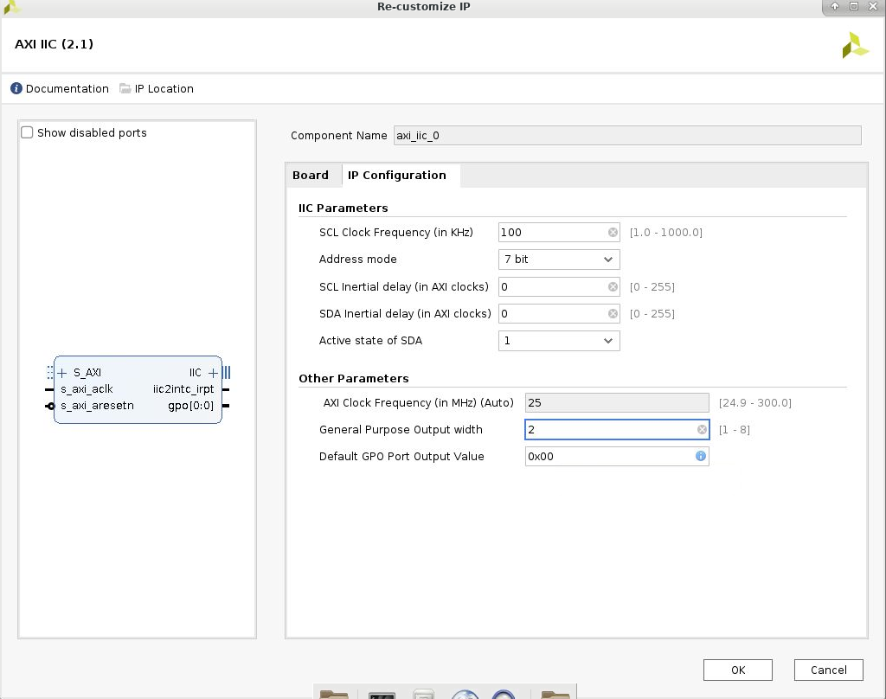
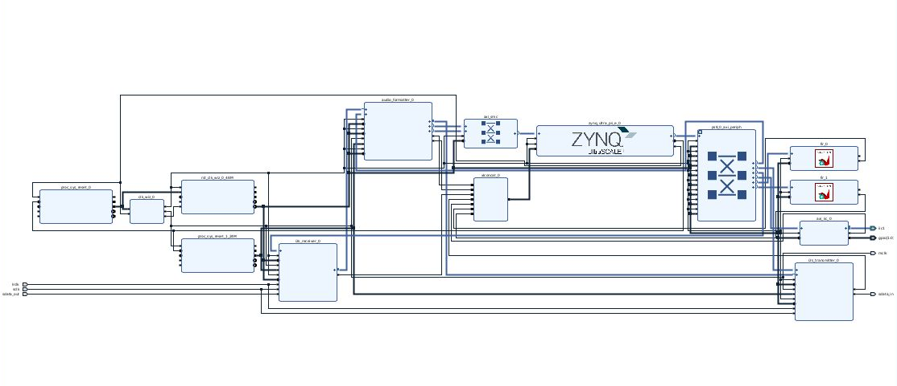

# HLS Design Flow – System Integration Lab

## Introduction

This lab illustrates the HLS design flow for generating IP from the Vitis™ HLS tool. The generated IP is then used to create a subsystem with the Arm® processor from a Zynq® UltraScale+™ MPSoC using the Vivado® IP integrator. The hardware from the Vivado Design Suite is imported into the Vitis environment, and the FIR application is then run on the ZCU106 development board. 

## Objectives
After completing this lab, you will be able to:
* Describe the HLS design flow to generate the Vivado IP 
design in Vitis HLS
* Identify the steps and directives involved in creating an IP within the Vitis HLS tool
* Create a system with the Arm processor from a Zynq UltraScale+ MPSoC and IP (fir filter) created with the Vitis HLS tool using the Vivado IP integrator flow
* Use a software application development flow to create and run the application on a development board

## The design
The design consists of a FIR filter to filter a 4 KHz tone added to CD quality (48 KHz) mUSIC.

This lab requires you to develop a peripheral core of the designed filter that can be instantiated in a processor system. The processor system will acquire a stereo music stream using an on-board CODEC chip and I2C controller, process it through the designed filter (bandstop filter), and output back to the headphone.

## Steps

### Downdload the audio ctrl IP 
Download the audio ctrl IP from https://github.com/Xilinx/PYNQ/tree/master/boards/ip/audio_codec_ctrl_v1.0/src, and put these 10 files into the **{labs}/lab4/ip_repo/zed_audio_ctrl/zed_audio_ctrl.srcs/sources_1/imports/i2s_audio** folder.

### Create a New Project
#### Create a new project in Vitis HLS targeting XCZU7EV-2FFVC1156 device
1. Invoke Vitis HLS Command prompt by selecting **Start > Xilinx Design Tools > Vitis HLS 2021.2 Command Prompt** then type **vitis_hls** in the terminal.
   A **Getting Started GUI** will appear.
2. In the *Getting Started* section, click on *Create Project*. The **New Vitis HLS Project** wizard opens.
3. Click **Browse…** button of the *Location* field, browse to **{labs}/lab4**, and then click **OK**.
4. For *Project* Name, type **fir** and click **Next**.
5. In the *Add/Remove Files* for the source files, type **fir** as the function name (the provided source file contains the function, to be synthesized, called fir).
6. Click the *Add Files…* button, select **fir.c** and **fir_coef.dat** files from the **{labs}/lab4** folder, and then click **Open**.
7. Click **Next**.
8. In the *Add/Remove Testbench Files* for the testbench, click the *Add Files…* button, select **fir_test.c** file from the **{labs}/lab4** folder and click **Open**.
9. Click **Next**.
10. In the *Solution Configuration* page, leave *Solution* Name field as *solution1* and make sure the clock period as **10**. Leave Uncertainty field blank.
11. Click on the Part’s Browse button and using the *Parts Specify* option, select **XCZU7EV-2FFVC1156**.
12. Click **Finish**.

    You will see the created project in the Explorer view. Expand various sub-folders to see the entries under each sub-folder.
13. Double-click on the *fir.c* under the *source* folder to open its content in the information pane.

       

       
       

       

       <i>The design under consideration</i>
       

       
       The FIR filter expects **x** as a sample input and pointer to the computed sample out **y**. Both of them are defined of data type data_t. The coefficients are loaded in array **c** of type coef_t from the file called *fir_coef.dat* located in the current directory. The sequential algorithm is applied and accumulated value (sample out) is computed in variable acc of type acc_t.
14. Double-click on the **fir.h** in the outline tab to open its content in the information pane.

     

     
     

     

     <i>The header file</i>
     

     
     The header file includes **ap_cint.h** so user defined data width (of arbitrary precision) can be used. It also defines number of taps (N), number of samples to be generated (in the testbench), and data types coef_t, data_t, and acc_t. The coef_t and data_t are short (16 bits). Since the algorithm iterates (multiply and accumulate) over 59 taps, there is a possibility of bit growth of 6 bits and hence acc_t is defined as int38. Since the acc_t is bigger than sample and coefficient width, they have to cast before being used (like in lines 16, 18, and 21 of fir.c).
15. Double-click on the **fir_test.c** under the testbench folder to open its content in the information pane.

    Notice that the testbench opens fir_impulse.dat in write mode, and sends an impulse (first sample being 0x8000).

### Run C Simulation

#### Run C simulation to observe the expected output.
1. Select **Project > Run C Simulation** or click on the button from the tools bar buttons, and click **OK** in the C Simulation Dialog window.
    The testbench will be compiled using apcc compiler and csim.exe file will be generated. The csim.exe will then be executed and the output will be displayed in the console view.
    

    
    

    

    <i>Initial part of the generated output in the Console view</i>
    

    You should see the filter coefficients being computed.

### Synthesize the Design with the defaults

#### Synthesize the design with the defaults. View the synthesis results and answer the question listed in the detailed section of this step.
1. Select **Solution > Run C Synthesis > Active Solution** to start the synthesis process.
2. When synthesis is completed, several report files will become accessible and the Synthesis. Results will be displayed in the information pane.
3. The *Synthesis Report* shows the performance and resource estimates as well as estimated latency in the design.
4. Using scroll bar on the right, scroll down into the report and answer the following question.  
    **Question 1**  
    Estimated clock period:   
    Worst case latency:   
    Number of DSP48E used:   
    Number of BRAMs used:   
    Number of FFs used:   
    Number of LUTs used:   
5. The report also shows the top-level interface signals generated by the tools.
    

    
    

    

    <i>Generated interface signals</i>
    

    You can see the design expects x input as 16-bit scalar and outputs y via pointer of the 16-bit data. It also has ap_vld signal to indicate when the result is valid.

### Run RTL/C CoSimulation

#### Run the RTL/C Co-simulation, selecting Verilog. Verify that the simulation passes.
1. Select **Solution > Run C/RTL Co-simulation** to open the dialog box so the desired simulations can be run.
2. Select the *Verilog* option and click **OK**.

   The Co-simulation will run, generating and compiling several files, and then simulating the design. In the console window you can see the progress. When done the RTL Simulation Report shows that it was successful and the latency reported was 68.

### Setting Up the AXI Lite Adapters and Re-synthesizing the Design
#### Add INTERFACE directive to create AXI4LiteS adapters so IP-XACdT adapter can be generated during the RTL Export step.

1. Make sure that **fir.c** file is open and in focus in the information view.
2. Select the **Directive** tab.
3. Right-click *x*, and click on **Insert Directive…**.
4. In the Vitis HLS Directive Editor dialog box, select **INTERFACE** using the drop-down button.
5. Click on the button beside *mode (optional)*. Select **s_axilite**.
6. In the *bundle (optional)* field, enter **fir_io** and click **OK**.
    

    
    

    

    <i>Selecting the AXI4LiteS adapter and naming bundle</i>
    

7. Similarly, apply the **INTERFACE** directive (including bundle) to the *y* output.
    

    
    

    

    <i>Applying bundle to assign y output to AXI4Lite adapter</i>
    

8. Apply the **INTERFACE** directive to the *top-level module fir* to include ap_start, ap_done, and ap_idle signals as part of bus adapter (the variable name shown will be return). Include the bundle information too. **There is a bug in the tool, as it does not update the directives.tcl file with this directive.**
    

    
    

    

    <i>Applying bundle to assign function control signals to AXI4Lite adapter</i>
    

    Note that the above steps will create address maps for x, y, ap_start ap_valid, ap_done, and ap_idle, which can be accessed via software. Alternately, ap_start, ap_valid, ap_done, ap_idle signals can be generated as separate ports on the core. These ports will then have to be connected in a processor system using available GPIO IP.

9. Worksaround for this bug is to modify the source code and apply using **pragma**. Enter the following line on line number 11. 

   #pragma HLS INTERFACE s_axilite port=return bundle=fir_io

   Save the file.

### Re-synthesize the design

#### Re-synthesize the design as directives have been added. Run the RTL Export to export the design as an IP.
1. Since the directives have been added, it is necessary to re-synthesize the design. Select **Solution > Run C Synthesis > Active Solution**.

   Check the Interface summary at the bottom of the Synthesis report to see the interface that has been created.
2. Once the design is synthesized, select **Solution > Export RTL** to open the dialog box so the desired IP can be generated.
    An **Export RTL Dialog** box will open.
    

    
    

    

    <i>Export RTL Dialog</i>
    

3. Click **OK** to export the design as an IP.
4. When the run is completed, expand the **impl** folder in the Explorer view and observe various generated directories, such as ip, misc, verilog and vhdl.
    

    
    

    

    <i>IP-XACT adapter generated</i>
    

    Expand the *ip* directory and observe several files and sub-directories. One of the sub-directory of interest is the drivers directory which consists of header, c, tcl, mdd, and makefile files. Another file of interest is the zip file, which is the ip repository file that can be imported in an IP Integrator design
    

    
    

    

    <i>Adapter’s drivers directory</i>
    

5. Close Vitis HLS by selecting **File > Exit**.

### Create a Vivado Project

#### Open a terminal and run the provided tcl script to create an initial system targeting the ZCU106 board.
1. First, open Vivado, and select _Create Project_, then create the blank project.

2. For “Default Part”, click _boards_ tab, and search _ZCU106_. When you click _Finish_, it’ll create blank project.

3. Click _Create Block Design_ on left pane (as indicated red square).

4. Right click anywhere in _Diagram_, and then, select _Add IP_, then search _zynq_. You will see _Zynq UltraScale+ MPSoC_. Click it and instantiate that block in Block Diagram.

    

    
    

    

    <i>Zynq UltraScale+ IP</i>
    

5. On top of the _Diagram_ pane, green bar showed up saying _Run Block Automation_, click this.

    

    
    

    

    <i>Block automation for Zynq UltraScale+ MPSoC</i>
    

6. Double click ZYNQ UltraScale+ block.

7. Select _PS-PL Configuration_ tab, then select _PS-PL Interfaces_ > _Slave Interface_ > _AXI HP_ to enable **AXI HP0 FPD**. This will create AMBA High Performance bus for DMA (Direct Memory Access). This is necessary for audio data transfer.

8. Select _PS-PL Configuration_ tab, then select _PS-PL Interfaces_ > _Master Interface_ to enable **AXI HPM0 LPD** and disable **AXI HPM0 FPD** and **AXI HPM1 FPD**.

    

    
    

    

    <i>Zynq UltraScale+ MPSoC IP customization</i>
    

#### Clocking
1. Right click anywhere in _Diagram_, select _Add IP_, then search _Clocking Wizard_. When the IP is instantiated, double click and open _Re-customize IP_ dialog.

2. Select _Output Clocks_ tab, and enable **clk_out2**. Then, set the frequency for both **clk_out1** and **clk_out2**. **clk_out1** will be 48MHz, and **clk_out2** will be 24MHz.

    

    
    

    

    <i>Clocking wizard customization</i>
    

3. Next, connect **pl\_clk0** in Zynq UltraScale+ MPSoC, and **clk_in1** in clocking wizard.

4. Instantiate _Processor System Reset_ IP, and connect **peripheral\_reset** and **reset** in clocking wizard.

    

    
    

    

    <i>Processor System reset</i>
    

5. Then click _Run Connection Automation_ on top.

6. Right click diagram, select _Add IP_, and instantiate _Audio Formatter_. Before running _Connection Automation_, connect clock sources to appropriate places. 
    
7. **clk_out1** (48MHz) from clocking wizard should be connected to:
    + **s_axi_lite_aclk** … AXI Lite4 bus clock
    + **s_axis_mm2s_aclk** … AXI Stream bus (memory mapped to stream) clock
    + **s_axis_s2mm_aclk** … AXI Stream bus (stream to memory mapped) clock

8. **clk_out2** (24MHz) from clocking wizard should be connected to **aud_mclk** (Audio Master clock).

9. Then, click _Run Connection Automation_. This action will instantiate several blocks:
    + Processor System Reset for 48MHz clock
    + AXI interconnect (For High Performance bus)
    + AXI interconnect (For AXI Lite bus connection)

10. Then _Run Connection Automation_ twice. It’ll connect signals listed below.
    + Reset signals
    + Clock signals
    + AXI Lite and AXI Stream buses
    
    

    
    

    

    <i>Connection Automation</i>
    

11. Instantiate one more _Processor System Reset_ for 24MHz clock. Then connect **peripheral_reset** signal to **aud_mreset** in Audio Formatter. Run connection automation.

#### I2S IPs
1. Instantiate _I2S transmitter_.

2. BEFORE running _Run Connection Automation_, connect **aud_mclk** to **clk_out2** from clocking wizard (24MHz), and **aud_mreset** to Reset System for 24MHz clock. 

3. Then run connection automation.

4. Also, this is important. Manually connect **s_axis_aud** in I2S transmitter, and **m_axis_mm2s** in Audio Formatter.

5. Instantiate _I2S receiver_ for recording. Same as _I2S transmitter_, but:
    + Connect **aud_mclk** to **clk_out2** (24MHz) from clocking wizard
    + Connect **aud_mreset** to **preripheral_reset** signal from Reset System for 24MHz
    + Connect **m_axis_aud** in I2S receiver to **s_axis_s2mm** in Audio Formatter
    + Run connection automation
        
    

    
    

    

    <i>I2S components</i>
    

#### I2S clocking
    I would strongly recommend using Audio CODEC’s clock as master. To do so, both I2S transmitter and I2S receiver have to be configured as _slave_.
1. Click _I2S transmitter_ and _I2S receiver_, and look at _Block Properties_ pane indicated below. Click _Properties_ tab in that pane.

2. In _CONFIG_ tab, find _C_IS_MASTER_, and set it to _0_ to configure it as slave. 
        
    

    
    

    

    <i>Block Properties</i>
    

3. Right click on **lrclk_in** pin, and select _Make External_ in dropdown. Do the same for **sclk_in**. Connect **lrclk_in** in another IP to the same pin. Do the same for **sclk_in**.
        
    

    
    

    

    <i>External pins</i>
    

#### Interrupt signal connection
    This step is crucial. Both I2S transmitter and I2S receiver will use DMA (Direct Memory Access), and transfer large block of data between processor, and these IPs. When the block transfer is done, this block will generate interrupt. This must be handled properly.

1.  Instantiate _Concat_ IP, and connect **dout** to **pl\_ps\_irq0**.

2. Double click _Concat_ IP, and increase the _number of ports_ property to _5_ (one more IP will be added, and that’ll generate interrupt as well). Right now, there are 4 interrupts to handle:
    + **s2mm** interrupt from Audio Formatter
    + **mm2s** interrupt from Audio Formatter
    + **irq** from I2S transmitter
    + **irq** from I2S receiver
        
    

    
    

    

    <i>Interrupt signals</i>
    

3. Make externals, then rename signals like below:
    + LR clock … **lrclk_in** in both I2S transmitter and receiver to **lrclk**
    + Bit clock … **sclk_in** in both I2S transmitter and receiver to **sclk**
    + Audio master clock … **clk_out2** from clocking wizard (24MHz) to **mclk**
    + Serial data IN … **sdata_0_out** in I2S transmitter to **sdata_out**
    + Serial data OUT … **sdata_0_in** in I2S receiver to **sdata_in**

#### I2C control interface
1. To make control interface, instantiate I2C modules. It’s confusing, but I2C module is named as **AXI IIC**. Search _iic_ and instantiate IP. Connect **s_axi_aclk** manually, then run connection automation.

2. For I2C, we need:
    + SCK … Serial Clock
    + SDA … Serial Data
    + I2C address … I2C address (2bits)

3. For now, **gpio** signal (it’ll be used as _address_ bits) is just one bit. Customize it to generate 2 bits address. Change _General Purpose Output width_ to 2.
        
    

    
    

    

    <i>AXI IIC customization</i>
    

4. Then, _Make External_ for **IIC** terminal, and **gpio** signal. Lastly, connect interrupt signal from AXI IIC IP to _Concat_.

#### Add the HLS IP to the IP Catalog
1. Select **Flow Navigator > Project Manager > Settings**
2. Expand **IP > Repository** in the left pane.
3. Click the **+** button (The lab4/ip_repo directory has already been added). Browse to **{labs}/lab4/fir/solution1/impl/ip** and click **Select**.

    The directory will be scanned and added in the IP Repositories window, and one IP entry will be detected.
4. Click **OK**.
    

    
    

    

    <i>Setting path to IP Repositories</i>
    

5. Click **OK** to accept the settings.

#### Instantiate fir_top core twice, one for each channel, into the processing system.
1. Click the *Add IP* icon (plus sign icon) and search for **Fir** in the catalog by typing **Fir** and double-click on the **Fir** entry to add an instance.
    Notice that the added IP has HLS logo in it indicating that this was created by Vitis HLS.
2. Similarly, add another instance of the HLS IP.
3. Click on **Run Connection Automation**, and select **All Automation**.
4. Click on **/fir_0/s_axi_fir_io** and **/fir_1/ s_axi_fir_io**. and verify that they will both be connected to the M_AXI_GP0, and click **OK**.

    

    
    

    

    

#### Verify addresses and validate the design. Generate the system_wrapper file, and add the provided Xilinx Design Constraints (XDC).
1. Click on the **Address Editor** if necessary. The generated address map should look like as shown below.
    

    
    

    

    <i>Generated address map</i>
    

2. Run *Design Validation* (**Tools > Validate Design**) and verify there are no errors
3. In the *sources* view, right-click on the block diagram file, **system.bd**, and select **Create HDL Wrapper** to update the HDL wrapper file. When prompted, click **OK** with the *Let Vivado manage wrapper and auto-update* option.
4. Click **Add Sources** in the Flow Navigator pane, select **Add or Create Constraints**, and click **Next**.
5. Click the *Add Files* button, browse to the **{labs}/lab4** folder, select **zcu106_audio_constraints.xdc**.
6. Click *Copy constraints files into project* and then click **Finish** to add the file.
7. Click on the **Generate Bitstream** in the Flow Navigator to run the synthesis, implementation, and bitstream generation processes.
8. Click **Save, Yes**, and **OK** if prompted to start the process.
9. When the bit generation is completed, a selection box will be displayed with *Open Implemented Design* option selected. Click **Cancel**.

### Export to Vitis and create Application Project
#### Export the hardware along with the generated bitstream to Vitis.
1. Select **File > Export > Export Hardware…**
2. Click **Next**
3. Make sure that *Include Bitstream* option is selected and click **OK**, leaving the target directory set to local project directory {labs}/lab4/audio.
4. Open **Vitis 2021.2**
5. Change the workspace to **{labs}/lab4/audio** and click **Launch**
6. In Vitis, select **File > New > Platform Project**
7. Enter **audio** as the *Platform project name* and click **Next**
8. For *XSA File*, browse to **{labs}/lab4/audio** and select **system_wrapper.xsa**
9. Click **Finish** with the default settings (with **standalone operating system**).
10. Select **File > New > Application Project**
11. Click **Next**
12. In **Select a platform from repository** tab, select **audio** as the platform.
13. Click **Next**
14. Enter **Test** as the *Project* Name and click **Next**
15. Click **Next**, select **standalone_domain** for the domain.
16. Click **Next**, select **Empty Application(C)** and click **Finish**
17. Select *Test* in the project view, right-click the *src* folder, and select **Import Sources...**
18. Browse to **{labs}/lab4** folder.
19. Select both **zcu106_testapp.c** and **zcu106_audio.h** and click **Finish** to add the files to the project. 
20. Select **Test_system** inn the *Assistant* view, right-click and select **Build**. The program should compile successfully.

### Verify the Design in Hardware

#### Connect a micro-usb cable between a PC and the JTAG port of the board. Connect an audio patch cable between the Line In jack and the speaker (headphone) out jack of a PC. Connect a headphone to the Line Out jack on the board. Power On the board.
1. Connect a micro-usb cable between a PC and the JTAG port of the board.
2. Connect an audio patch cable between the **Line In** jack and the **speaker out** (headphone)  jack of a PC.
3. Connect a headphone to the *HP+MIC* jack on board. Power **ON** the board.
4. Select **Xilinx > Program Device**.
5. Make sure that the **system_wrapper.bit** bitstream is selected.
6. Click **Program**.
    This will configure the FPGA.
7. Double-click **corrupted_music_4KHz.wav** or some other wave file of interest to play it using the installed media player. Place it in the continuous play mode.
8. Right-click on the *Test_system* in the **Assistant** view and select **Run > Run configuration**.
9. Double-click on the *System Project Debug* to create the Run configuration, and then click on **Run**

   The program will be downloaded and run. If you want to listen to corrupted signal then set the **SW0 OFF**. To listened the filtered signal set the **SW0 ON**.
9. When done, power OFF the board.
10. Exit Vitis and Vivado using **File > Exit**.

## Conclusion

In this lab, you developed an IP from the C design of a FIR filter using the Vitis HLS tool. Using the Vivado IP integrator, you next created a system with the Arm processor from the Zynq UltraScale+ MPSoC and the FIR IP. You then used a test application to write into and read from the IP interface registers.